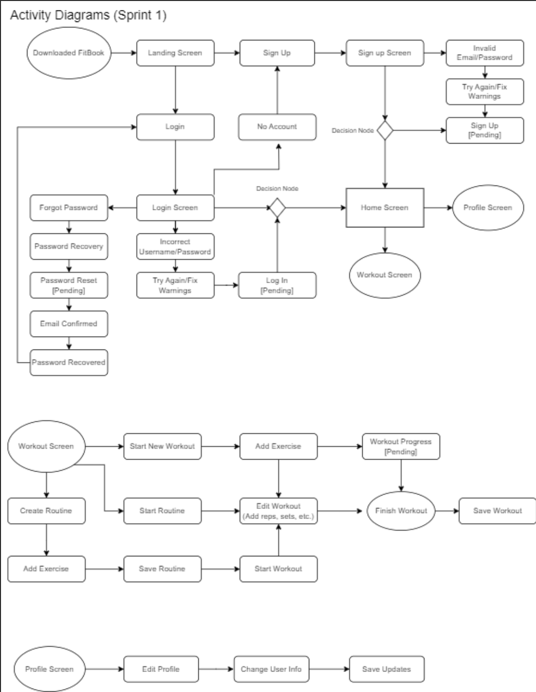

# FitBook

## Iteration 1 - Review & Retrospect

 * When: June 16, 2023
 * Where: Online

## Process - Reflection

We were not aware that the system design document was meant to be created beforehand, a very unfortunate oversight. Thus, we were overall less organized and prepared for the demo with the TA than we should have been. We will ensure to finalize all deliverables and features, alongside those who will demo the features on the next demo. 

#### Decisions that turned out well

Choice of front end - React Native
- Some members were already familiar with the react native framework, which allowed them to take initiative to become team leaders for the respective work
- Widely used in the industry, which provides numerous online documentation that we can use to learn

Choice of back end - MongoDB
- Flexible schema gives freedom for expansion without requiring a predefined model, which allows us to use it for different purposes (like storing workout data and storing user data)
- Integrates well with React Native through Mongoose, which makes it easy to implement API calls for the application

#### Decisions that did not turn out as well as we hoped

Adding too many features to our app
- Realizing that our prospective app was too large in scale after the initial planning caused us to divert attention to perhaps downscaling our app

Using simple-toast library
- Although we strayed away from it, we didn’t realize there were compatibility issues with developers that have the m1 apple silicon chip. The debugging process took a little bit of time but eventually, we found the issue and uninstalled the incompatible library and opted for another library.

#### Planned changes

Downscaling our app (possibly removing some features and user stories that relate to it)
- We realized that not all features are possible to implement within the small amount of time period we are given to build the app. Thus, instead of finalizing the project with an unfinished app, we decided it may be beneficial to downscale the app for sake of a more complete app.

Unifying the design on all screens (log-in failed message differs from sign-up failed message, which uses toast)
- While exploring new methods to display error messages, we came across the toast-message library, which was used to indicate signup failure to the user. Since uniform design is important for a consistent user experience, we decided to utilize this library for other error messages and short form notifications to the user. However, because this was a recent addition to our library, it has not yet been rolled out to every existing feature.

## Product - Review

#### Goals and/or tasks that were met/completed:

[Signup Functionality](https://hoomji.atlassian.net/browse/FB-14?atlOrigin=eyJpIjoiZTlmOTM5Yzk4NGU0NDgzY2I0YTM5MDFhNjNhZDViZTIiLCJwIjoiaiJ9)
- Was a planned part of sprint1 functionality

[Login Functionality](https://hoomji.atlassian.net/browse/FB-5?atlOrigin=eyJpIjoiYTNjNjBkMTZmYTYyNDU2NTlhZTE1MDFlYTVkZjM4ZDciLCJwIjoiaiJ9)
- Was a planned part of sprint1 functionality

[Landing Screen](https://hoomji.atlassian.net/browse/FB-88?atlOrigin=eyJpIjoiNzE3YjU0Y2M4NGIxNGFlOWJjNWI2ZDIxOWJmYWUwMTciLCJwIjoiaiJ9)
- Was a planned part of sprint1 functionality

#### Goals and/or tasks that were planned but not met/completed:

Forgot Password Functionality (in progress)
- Is more related to the sprint1 (is related to the login functionality). We didn’t get to it in time and it required more research than originally anticipated.

Homepage (in progress)
- The homepage will also include the user feed, so while debating the design, we did not get to it in time.

Workout Screen (under code review)
- Is under code review, just was not merged with main in time for sprint1.

FitBook Profile (in progress)
- We did not get to it in time 

## Meeting Highlights

Going into the next iteration, our main insights are:

For the upcoming iteration, our primary focus will be to complete the “second layer” of our application, involving the implementation of the profile, homepage, and workout. This means designing the necessary screens, user interaction, navigation, and the corresponding backend implementation to deliver a quality experience. To further elaborate:
- Profile
    - In the upcoming iteration, we plan to finalize all aspects related to profile functionality. This includes the design and implementation for users to view and update their profile and relevant information, such as name, profile picture, and bio. Furthermore, we will integrate the backend API’s to handle the storage, retrieval, and update of profile information.
- Homepage
    - Next, we plan to finalize aspects related to the homepage functionality, including a visually appealing and user-friendly interface where users can discover and interact with various contents, like posts made by friends.
    - We expect the sharing of posts to be a more complicated task, and will focus on integrating the backend API for user connections, allowing us to focus on sharing posts in a later sprint.
- Workout
    - For the workout functionality, we plan on completing the code review for the workout screen functionality of adding exercises to a workout. From there, we plan on having the functionality of having users be able to log their workouts implemented.
- Navigation bar
    - In addition to all functionality listed above, we will implement a simple, yet visually intuitive navigation bar for the users to browse through the screens listed above. 

    

